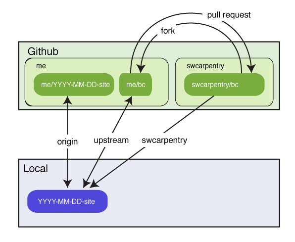
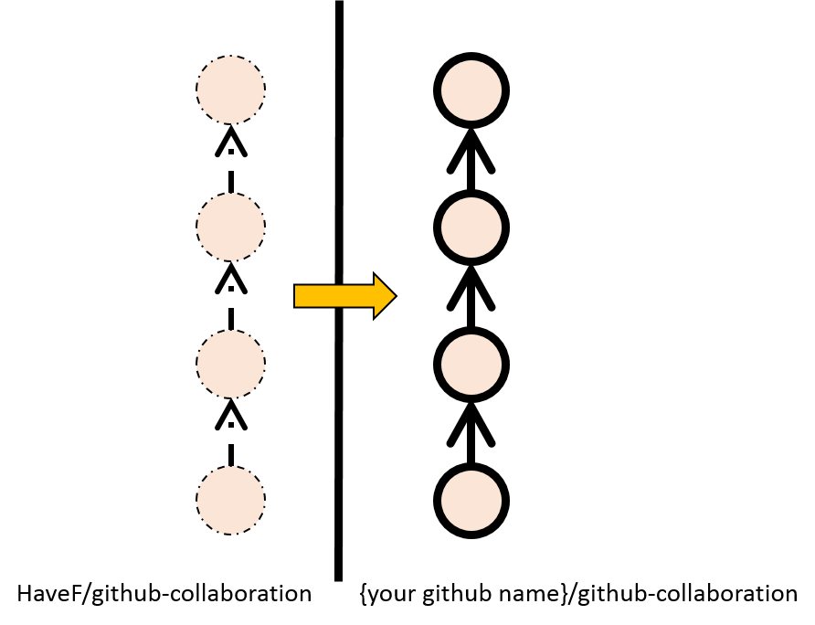
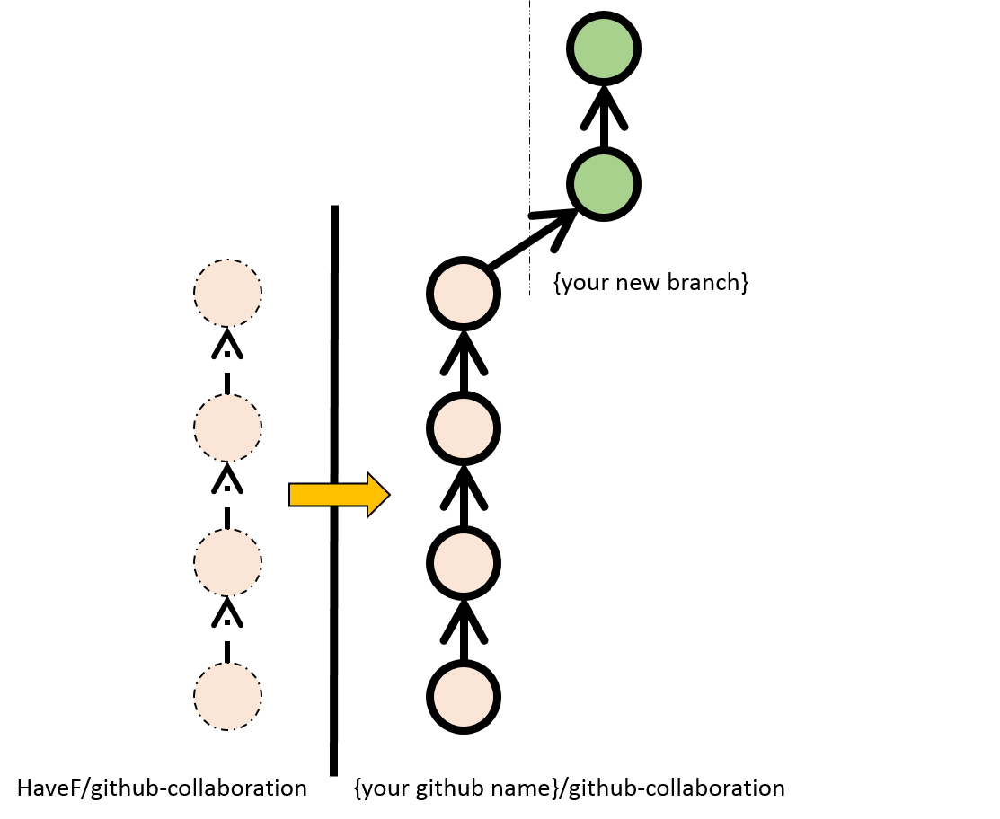
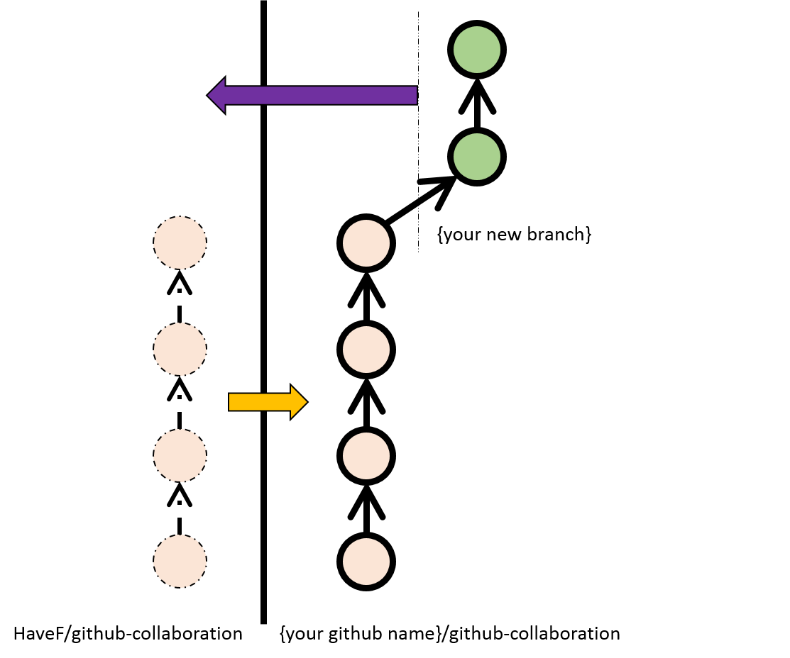
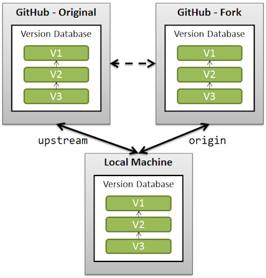
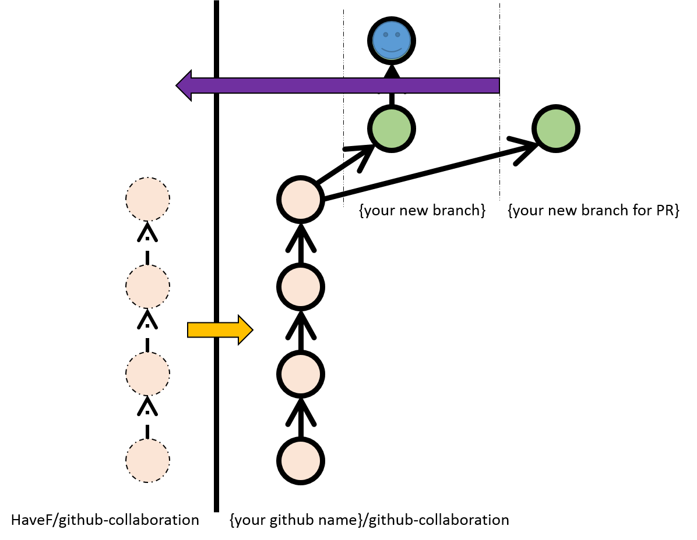
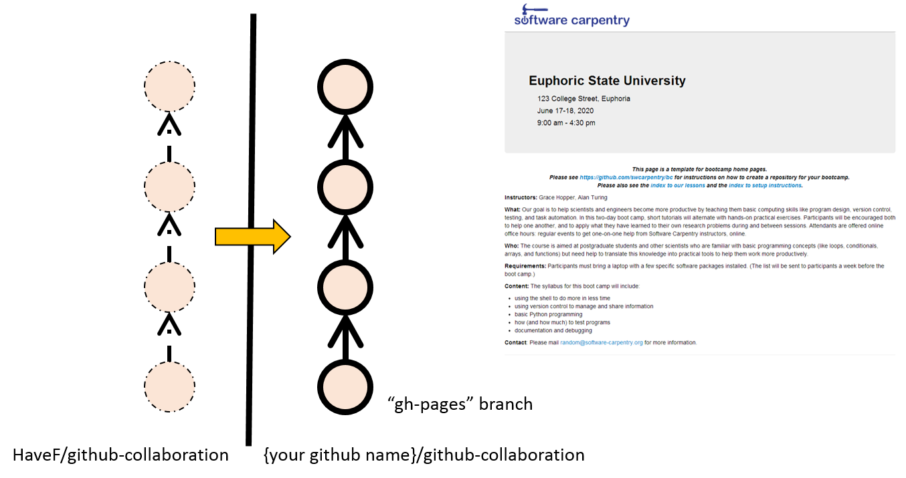
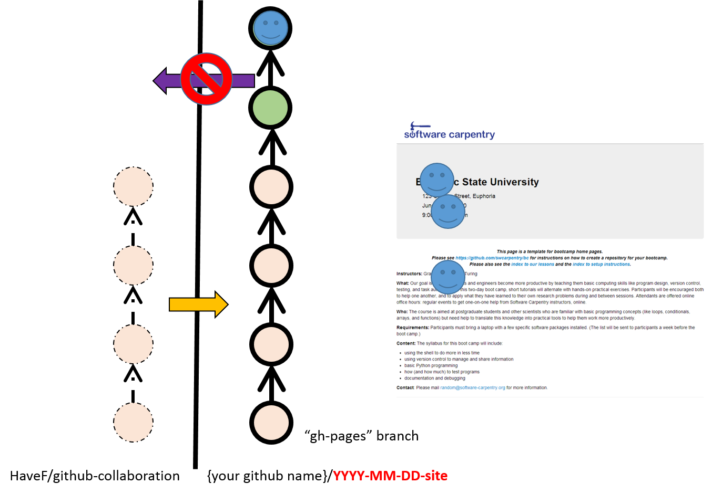
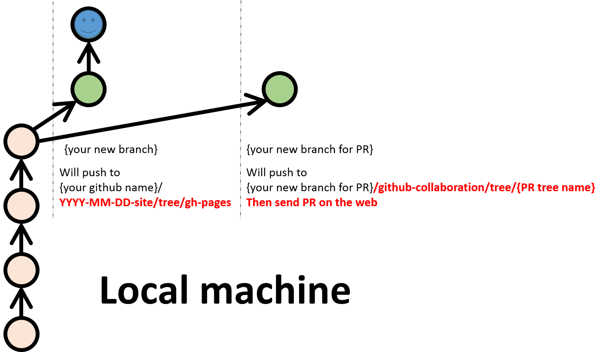

github-collaboration
--------------------

Training course for GitHub.

This course is used for training newbies the basic concept and
workflows about Github.

**Table of Contents**

- [Background](#background)
- [SWC's repo maze ](#swcs-repo-maze-dizzy_face)
    - [Basic GitHub fork idea](#basic-github-fork-idea)
    - [Your original intention  may only to use the repo ](#your-original-intention--may-only-to-use-the-repo-)
    - [The gh-pages thing](#the-gh-pages-thing)
- [Web based workflow (The easiest)](#web-based-workflow-the-easiest)
- [Command line or gui based workflow (The most flexible)](#command-line-or-gui-based-workflow-the-most-flexible)
- [Tips](#tips)

Background
----------

You should know some basic concepts (or commands) of Git. Like:

* branch
* checkout
* clone
* remote
* push
* pull
* repository (a.k.a. "repo")

If you want to collaborate to others well, you also should know:

* rebase
* commit --amend
* cherry-pick

SWC's repo maze :dizzy_face:
----------------------------

It is a little bit crowded:family::two_women_holding_hands::dolls::couple::two_men_holding_hands: 
when you see it in first time.

Let's forget it first.

Basic GitHub fork idea
======================

1. After you click Fork button.

 

2. You made some changes in new branch.

 

3. You can send PR (Pull Request) now.

 

4. In GitHub culture, it always call your forked repo `origin`, the 
original repo `upstream`(in most of time, you don't have permission to access upstream, 
the figure below say you *have* that permission). They are just names, don't worry.

 

Your original intention  may only to use the repo 
=================================================

The blue :blush: in the figure below represent your personal data, like your name,
your logo and something like that. The green :tennis: in the figure stands for the
useful commit you want to send. In that time, you should checkout a new branch for
PR, and [`cherry-pick`](https://www.kernel.org/pub/software/scm/git/docs/git-cherry-pick.html)
the :tennis:, after that push that branch and send a PR on the web.

The gh-pages thing
==================

The branch who's name is `gh-pages` can be benefited from [Github pages](http://pages.github.com/).
So, every repo have only one gh-pages on the web.

As we know before, your custom data cannot be send PR directly.

But you can setup several branches for different remote repo, like this:

`{your new branch}` is used for demonstrating your customed page.

`{your new branch for PR}` should push to your remote `{github-collaboration}`, and send PR on the web later.

Web based workflow (The easiest)
--------------------------------

Demo and practice time!

Reference: [GitHub Flow in the Browser](https://github.com/blog/1557-github-flow-in-the-browser)

1. fork
2. make a **new branch**
3. change
4. send PR (pull request)
5. discuss with others
6. improve it
7. accepted

Prrrrrrrrractice items:
- [ ] Fix the `Prrrrrrrrractice` to `Practice`
- [ ] Fix the title `github-collaboration` to `GitHub-collaboration`
- [ ] Fix whatever you want
- [ ] Send A PR
- [ ] Discuss it. Include:
    - [ ] Make a reference to other issue
    - [ ] Reply discussion in mail
    - [ ] Use @ to mention other

Prons and cons:
* Easy and quick to use
* Friendly to users (also include newbies)
* Even no need to install Git!
* Less disruptive workflows
* (x)Hard to reuse (like pull new commits from the original repo, rebase the PR)

Command line or gui based workflow (The most flexible)
------------------------------------------------------

Demo time! (No practice because the limited time:sweat_smile:)

Compare with [Web based workflow (The easiest)](#web-based-workflow-easiest).

1. fork --> fork on the web, then clone to local
2. make a **new branch**  --> checkout a new branch at local
3. change --> may include checkout a new branch for PR, rebase, cherry-pick, etc.
4. send PR (pull request)  --> push the new local branch to your forked repo, then send PR on the web
5. discuss with others
6. improve it
7. accepted

Tips
----

* Be nice:bowtie:, be polite, remember, you are discussing with people:bow: who have different personality only by text:memo:,
maybe you can use [EMOJI](http://www.emoji-cheat-sheet.com/) when you are discussing:wink:, and reply to contributors
as soon as possible:+1:, especially you are the repo's owner:innocent:.
* Write the commit message more informative (On the other hand, you need to hide the commit detail)
